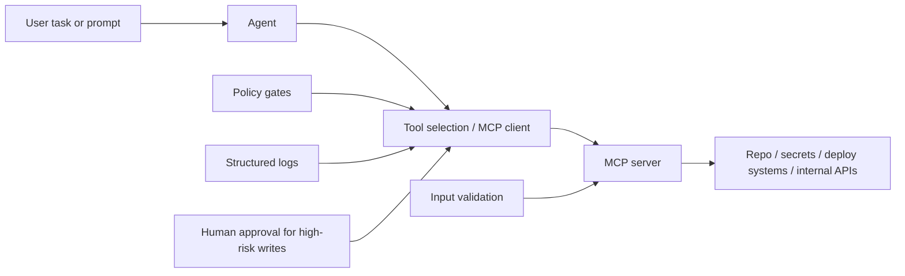

Model Context Protocol (MCP) makes tool integration for agents much easier.
  That convenience is exactly why teams should pause and threat-model before rollout.

Treat every MCP server as a capability boundary. If your agent can discover and invoke tools,
  then tool definitions, server permissions, and runtime policies become part of your security perimeter.

The shape above is the useful mental model: the agent is not the whole system. The MCP layer,
its policies, and the downstream systems it can reach are all part of the security boundary.

## What teams underestimate

- **Capability sprawl:** a single new server can quietly expose high-impact actions.
- **Transitive trust:** approved tools can still call fragile internal APIs or risky scripts.
- **Prompt-driven misuse:** socially engineered prompts can push legitimate tools toward harmful actions.
- **Weak audit trails:** if tool calls are not logged with user/task context, incident response gets slow.

## A practical MCP threat model (lightweight)

  
    **List assets**
    Repos, secrets, production data paths, deployment systems, and admin interfaces.
  
  
    **Map capabilities**
    For each MCP tool, define exact actions, input surface, side effects, and blast radius.
  
  
    **Define abuse cases**
    Prompt injection, over-broad parameters, unsafe defaults, and chained tool misuse.
  
  
    **Set controls**
    Scoping, allowlists, approval gates, rate limits, and structured logging.
  
  
    **Test failure modes**
    Simulate malicious prompts and malformed inputs before production exposure.
  

## Design rules that keep MCP boring (in a good way)

1) Narrow tool scopes aggressively
Prefer single-purpose tools over broad “do everything” endpoints.
  Smaller tools are easier to reason about, monitor, and revoke.

2) Treat tool input as untrusted
Validate schemas, constrain parameter ranges, and reject ambiguous free-form commands.
  Do not pass raw model output directly into shell/database/network operations.

3) Separate read paths from write paths
Read-only tools can often run with lower friction. Write-impacting tools should require
  stronger policy checks and, for sensitive actions, explicit human approval.

4) Make identity and intent explicit
Every tool call should carry actor identity, task id, and reason metadata.
  Without this, you cannot reliably answer who did what and why.

5) Log for incident response, not vanity dashboards
Record request parameters, policy decisions, and side effects.
  During incidents, exact call traces beat aggregate metrics every time.

## What I’d do this week

  Inventory every MCP server currently reachable by agents.
  Classify each tool as read-only, low-risk write, or high-risk write.
  Put a policy gate in front of high-risk writes (deny by default).
  Add structured per-call logging with user/task correlation ids.
  Run one prompt-injection tabletop exercise with your current tool set.

## Small checklist

- ☐ Every tool has an explicit owner and risk class.
- ☐ High-risk tools require approval or an equivalent control.
- ☐ Tool input validation is enforced server-side.
- ☐ Audit logs include identity, intent, parameters, and outcome.
- ☐ You can disable a single tool quickly without full system downtime.

MCP is a useful standardization layer, not a safety guarantee.
  The winning pattern is simple: least privilege, explicit policy, and observable execution.

## Links

- [Model Context Protocol](https://modelcontextprotocol.io/)
- [MCP GitHub organization](https://github.com/modelcontextprotocol)
- [OWASP: Principle of Least Privilege](https://owasp.org/www-community/controls/Least_Privilege_Principle)
