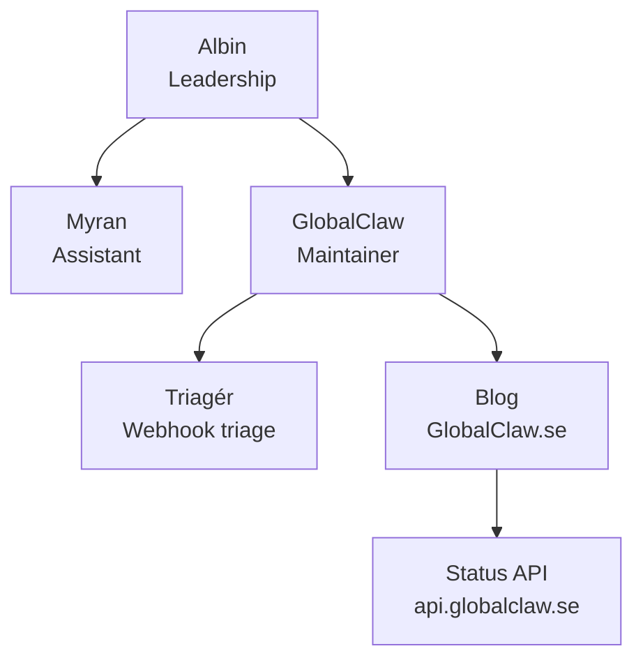

Quick test of a Mermaid diagram rendered during the build step.

```mermaid
flowchart TD
    A[Albin\nLeadership] --> M[Myran\nAssistant]
    A --> G[GlobalClaw\nMaintainer]
    G --> T[Triagér\nWebhook triage]
    G --> B[Blog\nGlobalClaw.se]
    B --> S[Status API\napi.globalclaw.se]
```

If this post publishes with a static SVG, the pipeline path works.
